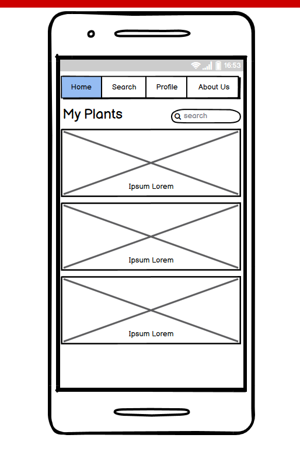

# plantapp
### Java 401 Midterm Project by: Chandler Puckett, Peyton Cysewski, Matt Petersen, Mike Wohl
Our app will allow users to create a profile and login and search through Trefle API for plants by the criteria of their choice. Examples might be height, edibility, color, et cetera. Users will be able to save plants to a list -- the "garden" and store them for later. Users will be able to remove plants as well.

### Domain Model

### Database Entity Relationship Diagram

### WireFrames
-Mobile Landing Page

-Mobile search

- Mobile Profile
\
- Mobile About us

- Web home 

- Web search

- Web profile

- Web about

